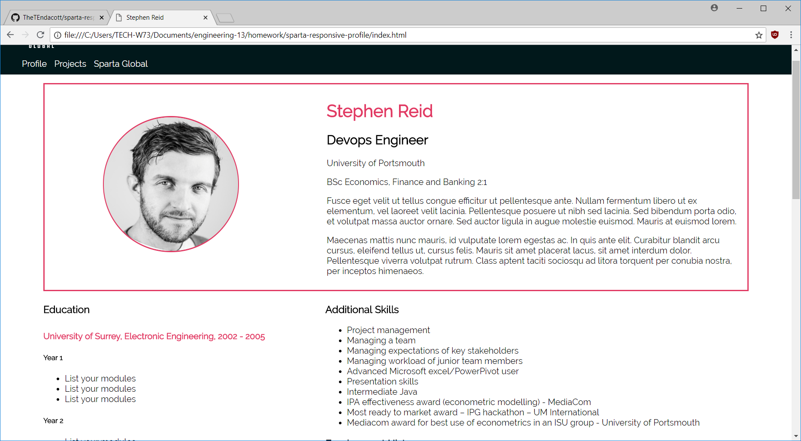

# Sparta Responsive profile

Using media queries in CSS I was able to make the pages respond to being viewed in different browser sizes or devices.

Targeting certain elements on the page it became possible to have them moved to a different location and resize themselves when done so.

Some of the challenges were making certain page elements move where I wanted as initially they did not move where expected or according to their visible layout on the page.

*This was done in week 2 of the engineering stream*

## The Project Outline
### CSS Media Queries Lab

#### Timings

45 - 60 minutes

#### Summary

Starting from an unresponsive CSS layout of Steve's profile (or your own version if you prefer) use CSS media queries to make the website aesthetically pleasing at all screen widths and devices. Ensure the page has at least two noticeably different layouts at different screen widths.

Here are some helpful hints to get you started:

 - Remember that CSS is read downwards and overwrites as it goes down
 - Start mobile first - how does this dictate what kind of media query you will use?
 - The panels on the projects page are perfect for making responsive - how could you position them to make better use of the space you have?
 - Have a look at common websites and how they handle responsiveness - how complex is a usual mobile page compared to a full width desktop page?

#### Bonus Tasks

 1. Have two breakpoints, giving a mobile, tablet and desktop view
 2. Simplify your CSS as much as possible - prizes for the least lines of CSS code!
